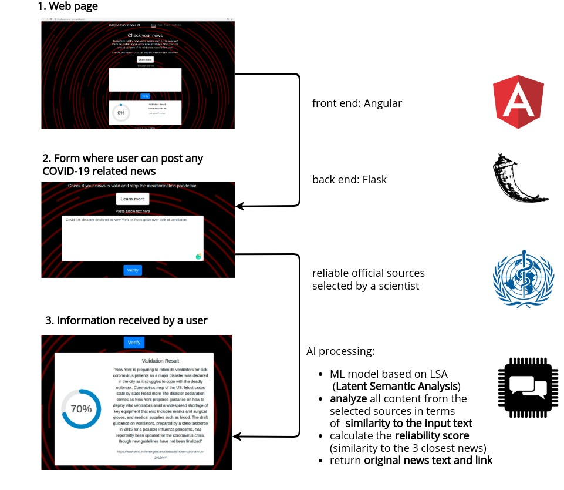

# CORONA FACT CHECK AI

We’ve developed a simple yet fully functional automatic solution for comparing given news stories with reliable sources and for checking if it is valid or not, with the help of AI.

## Getting started for development

To get started with development, please check out respective directories for each module.

* `cfai-data-crunching` - Machine Learning library for news analysis
* `cfai-backend` - REST API exposing the news analisis engine
* `cfai-frontend` - Angular-based web UI

## Deployment

Currently the app is being deployed on Google Cloud with help of docker.

## Technology

## Built With

* Python - backend and ML language
* TypeScript - Frontend development
* Flask - The web framework used
* Docker and docker compose - environments and deployment
* Angular - reactive UI

## Versioning

We use [SemVer](http://semver.org/) for versioning. For the versions available, see the tags on this repository.

## License

This project is licensed under the MIT License - see the [LICENSE.md](LICENSE.md) file for details
